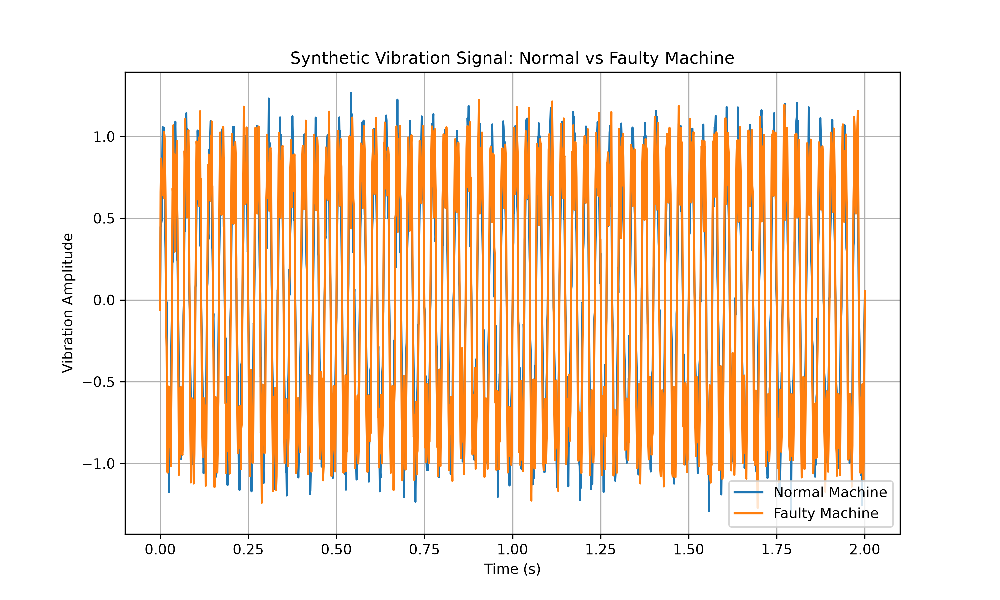
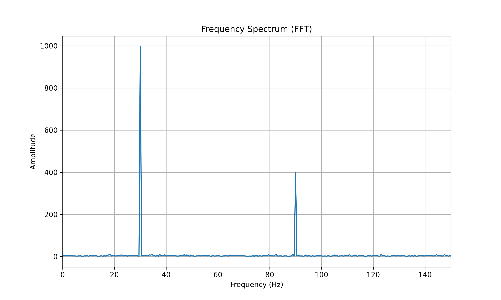
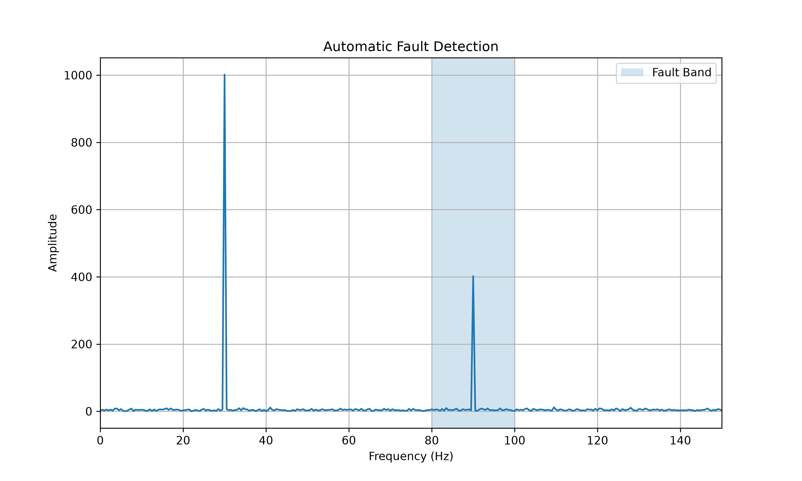

# Predictive Maintenance Fault Detection

A Python-based project demonstrating predictive maintenance concepts using synthetic vibration data.

The project compares normal and faulty machine vibration behaviour to show how signal patterns can be used for fault detection in rotating machinery.

## Project Pipeline

Synthetic vibration data  
→ FFT frequency analysis  
→ Automatic fault detection  
→ Feature extraction  
→ Dataset generation  
→ Machine learning classification

## Current Features

- Synthetic vibration signal generation
- Normal vs faulty machine comparison
- Time-domain signal plotting
- Python engineering data visualisation
- Machine learning fault classifier using Random Forest
- Model accuracy evaluation
- Confusion matrix and classification report

## How to Run

```bash
python synthetic_vibration_data.py
```

python train_fault_classifier.py

## Example Results

### Time-Domain Vibration Signal



### FFT Frequency Spectrum



### Automatic Fault Detection



## Model Performance

The trained Random Forest classifier achieved strong performance on the synthetic vibration feature dataset.

Detailed results are saved in:

```text
model_results.txt
```
